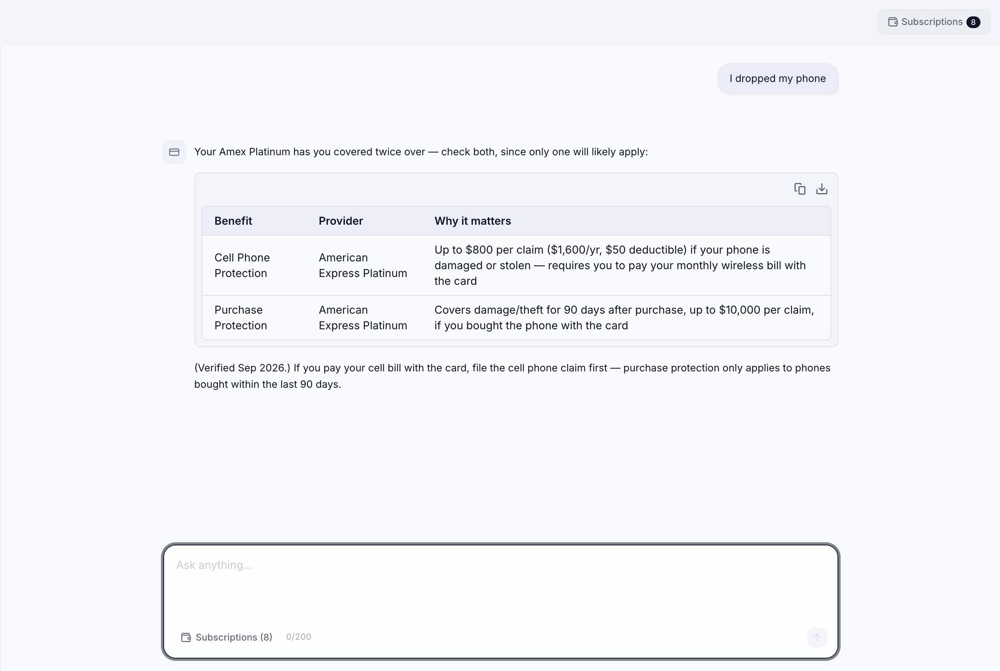

# Use Your Subscriptions

A chatbot that tells you which of your cards and memberships actually apply to what you are doing, using real benefit data instead of generic advice.

Live: https://chatbot.membershipmaxxing.workers.dev

## What it does

- Pick the subscriptions you already have (Amex Platinum, Chase Sapphire Reserve, Costco, CLEAR, hotel and rental car status, and more).
- Your selection is saved in the browser, so there is no account and no login.
- Ask something like "I dropped my phone" or "I need to rent a car" and it looks up your real benefits, then answers with the specific perk, coverage, and caveats.
- Selecting a parent program (Amex Platinum) offers to add the programs it bundles, like Hilton Honors Gold, Hertz status, and DoorDash DashPass.
- Chats are not stored. Answers are grounded in the benefits database, with a "verified" date on specific amounts.

## Stack

- Next.js 16 running on Cloudflare Workers via vinext
- Cloudflare D1 for the benefits catalog
- Drizzle ORM
- DeepSeek for the model
- Tailwind CSS

## Data

The catalog covers 65 providers with their benefits, including points earning rates and perks. Each benefit carries provenance fields (source, last verified, status). A sync script can pull issuer pages and produce reviewable update proposals.

## Status

Proof of concept. Anonymous, no persistence, rate limited per IP.
